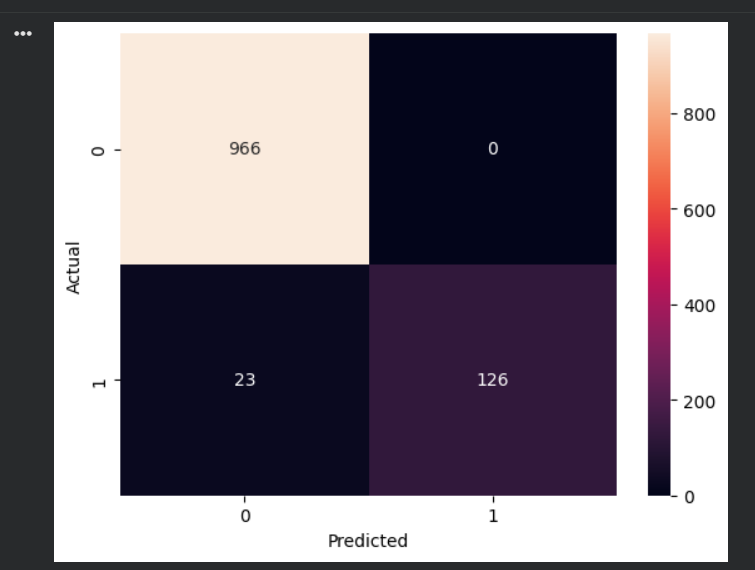

# SMS Spam Detection using Machine Learning

This project classifies SMS messages as spam or ham using Machine Learning.

## Tools Used
Python, TF-IDF, Naive Bayes, Scikit-learn, Google Colab

## Model
Multinomial Naive Bayes with TF-IDF vectorization  
Accuracy achieved: ~97%

## Output

## Author
Ganipisetty Madhuri
